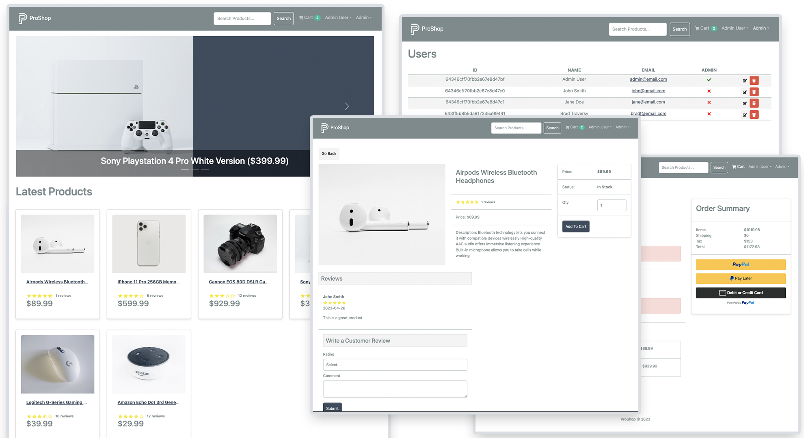

# ProShop eCommerce Platform

A full-stack eCommerce platform built with the MERN stack (MongoDB, Express, React, Node.js). This project features a complete shopping cart, user reviews, admin product management, PayPal integration, and pagination.

## 🚀 Features

* **Full-featured Shopping Cart:** Add items, adjust quantities, and calculate totals.
* **Product Reviews:** Registered users can rate and review products.
* **Admin Dashboard:** Manage products, users, and orders.
* **PayPal Integration:** Fully functional checkout using PayPal Sandbox.
* **Search & Pagination:** Efficiently browse large catalogs.
* **Responsive Design:** Works on mobile, tablet, and desktop (React-Bootstrap).

## 🛠 Tech Stack

* **Frontend:** React, Redux Toolkit, React-Bootstrap, React-Router-Dom
* **Backend:** Node.js, Express.js
* **Database:** MongoDB (Mongoose)
* **State Management:** Redux Toolkit (RTK Query)

## 🏁 Getting Started

Follow these steps to get a local copy up and running.

### 1. Prerequisites

Ensure you have the following installed:
* Node.js (v16+)
* MongoDB (Local or Atlas URL)

### 2. Installation

Clone the repository and install dependencies for **both** the backend and frontend.

```bash
# Clone the repo
git clone (https://github.com/hughmorris01/proshop.git)
cd proshop

# Install Backend dependencies (Root)
npm install

# Install Frontend dependencies
cd frontend
npm install
cd ..
```

### 3. Environment Variables

**Step A: Backend Configuration**
Create a `.env` file in the **root** directory. You can use `example.env` as a reference.

```env
NODE_ENV=development
PORT=5000
MONGO_URI=your_mongodb_connection_string
JWT_SECRET=your_secret_key_123
PAYPAL_CLIENT_ID=your_paypal_sandbox_id
PAGINATION_LIMIT=8
```

**Step B: Frontend Configuration (Required for Node v18+)**
Create a separate `.env` file inside the **`frontend`** folder. This fixes Webpack security errors on newer Node versions.

```env
# Location: /frontend/.env
DANGEROUSLY_DISABLE_HOST_CHECK=true
```

> **Note:** If you don't have a PayPal ID, the checkout screen may throw errors. You can get a Sandbox ID from developer.paypal.com.

### 4. Database Seeding (Crucial Step)

The app will load with an empty screen if the database is empty. You must run the seeder script to populate it with sample data (Users and Products).

```bash
# Run this from the root folder
npm run data:import
```

To clear the database completely, run `npm run data:destroy`.

### 5. Run the Application

This project uses `concurrently` to run the React frontend (Port 3000) and Node backend (Port 5000) with a single command.

```bash
npm run dev
```

Open http://localhost:3000 to view it in the browser.

## 🐛 Troubleshooting

**"Invalid options object / allowedHosts error"**
If the app crashes on launch with an `allowedHosts` error, ensure you created the `.env` file inside the `frontend` folder as described in Step 3B.

**"Products list is empty / Spinning Loader"**
This usually means you skipped Step 4. Stop the server and run `npm run data:import`.

**"PayPal Script Error"**
Ensure your root `.env` file has a valid `PAYPAL_CLIENT_ID`. If you are testing, use a Sandbox client ID, not a generic string.

**"Product already reviewed"**
The system prevents users from reviewing the same product twice. Create a new user account to test the review feature again.

## 📝 License

This project is open source and available under the MIT License.
